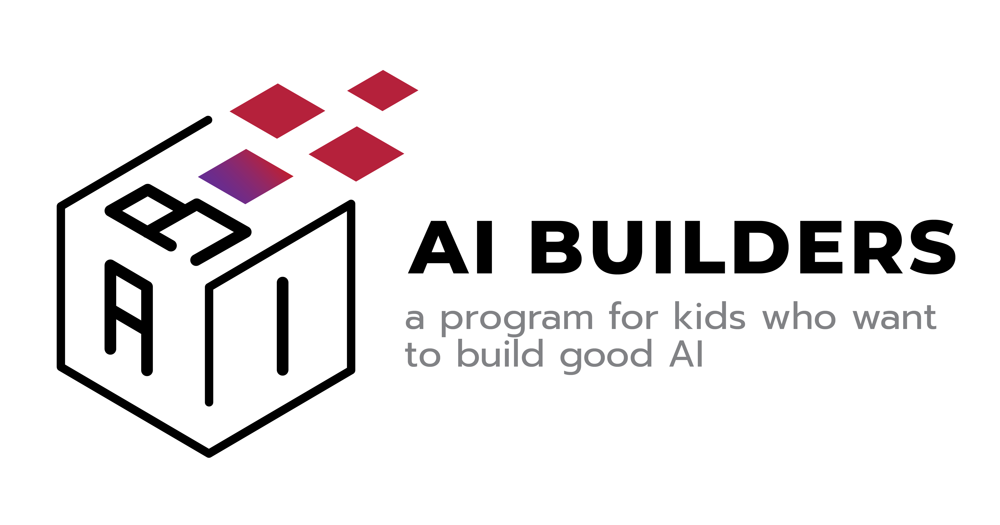

# AI Builders 2024

Welcome to the AI Builders 2024 repository! This repository contains various Python code examples designed for learning and showcasing different programming tasks.



## Table of Contents
- [Arith Geo](#arith-geo)
- [Sum Multiplier](#sum-multiplier)
- [Letter Count I](#letter-count-i)
- [String Periods](#string-periods)
- [Grouped Mean](#grouped-mean)
- [Three Numbers](#three-numbers)
- [Simple Password](#simple-password)
- [Other Products](#other-products)
- [Date Manipulation](#date-manipulation)
- [Updating Shopping Carts](#updating-shopping-carts)
- [CSV to JSON Conversion](#csv-to-json-conversion)
- [Permutation Step](#permutation-step)
- [Getting Started](#getting-started)
- [Contributing](#contributing)
- [License](#license)

## Arith Geo
This section contains scripts to check if a given sequence is arithmetic or geometric.


## Sum Multiplier
A script that checks if the sum of the elements in the list, multiplied by 2, is greater than the product of the elements.


## Letter Count I
A script to count the occurrence of each letter in a given string.


## String Periods
A script to find the shortest period of a string, where the period is defined as the smallest substring that can be repeated to create the entire string.


## Grouped Mean
Calculate the mean of values grouped by a certain criteria.


## Three Numbers
A script to find three numbers in a list that add up to a target sum.


## Simple Password
Scripts for validating simple passwords based on basic criteria.


## Other Products
Calculate the product of all elements in a list except the current one for each element.


## Date Manipulation
Learn how to manipulate dates using Python, including formatting and calculating date differences.


## Updating Shopping Carts
Code examples to update shopping cart contents, calculate totals, and more.


## CSV to JSON Conversion
Scripts for converting CSV files to JSON format, useful for data interchange and processing.


## Permutation Step
A script to find the next permutation of a number in lexicographic order.


## Getting Started
1. Clone the repository:
    ```sh
    git clone https://github.com/Hariwo711/Ai_Builders_2024.git
    ```
2. Navigate to the project directory:
    ```sh
    cd Ai_Builders_2024
    ```
3. Run the desired script:
    ```sh
    python script_name.py
    ```

## Contributing
Contributions are welcome! Please fork the repository and create a pull request with your changes.

## License
This project is licensed under the MIT License. See the [LICENSE](LICENSE) file for details.
